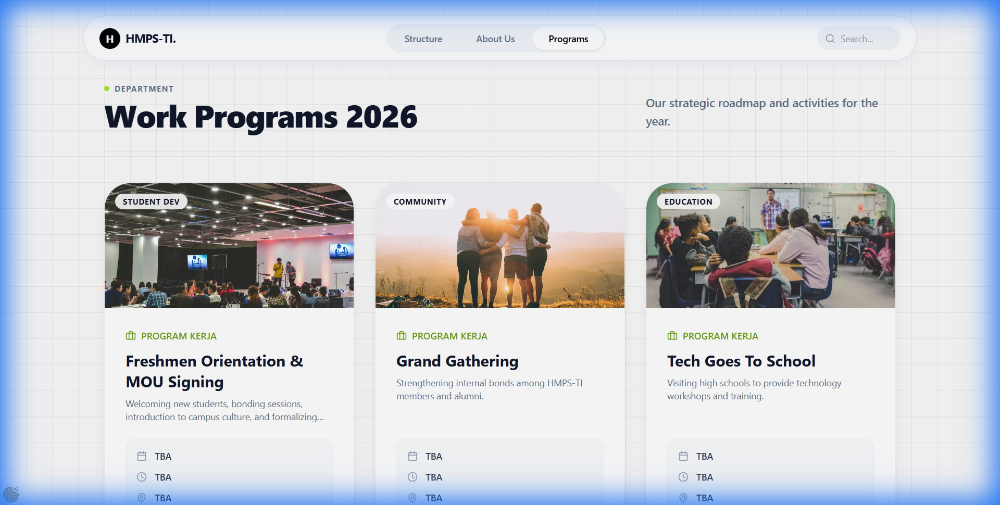
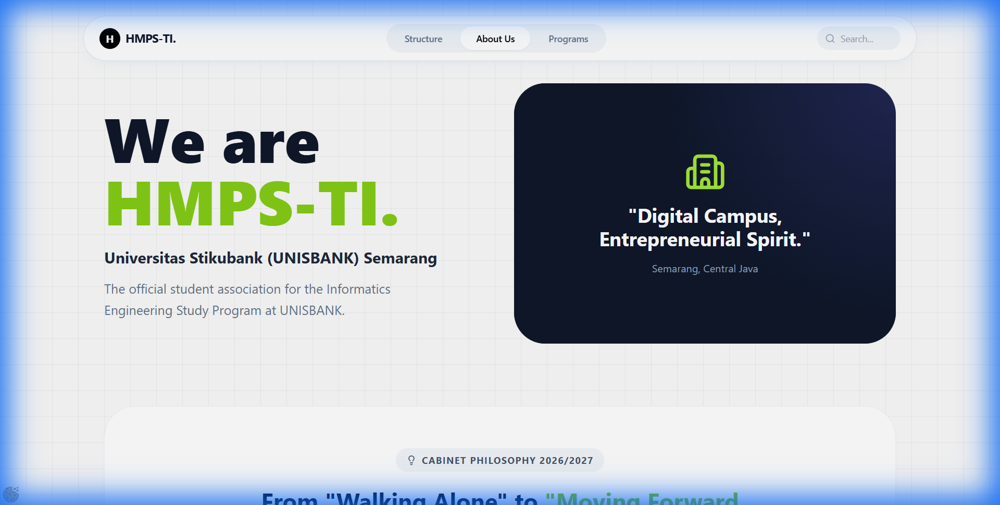
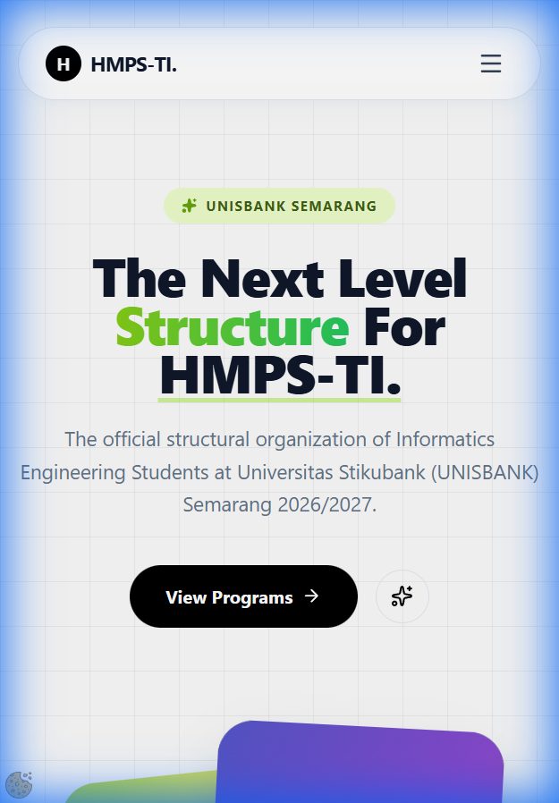

<div align="center">
  # 🚀 HMPS-TI UNISBANK SEMARANG
  ### Organizational Structure & Programs • Period 2026/2027
  
  [](https://react.dev/)
  [](https://vitejs.dev/)
  [](https://www.typescriptlang.org/)
  [](https://www.framer.com/motion/)
</div>

---

## 📖 Overview

The **HMPS-TI Structure 2026/2027** is a modern, high-performance web application designed to showcase the organizational structure, executive board, and work programs for the Informatics Engineering Student Association (HMPS-TI) at **Universitas Stikubank (UNISBANK) Semarang**.

Built with a focus on **visual excellence**, **smooth interactions**, and **mobile-first design**, this application serves as the digital face of the organization.

## ✨ Key Features

- **🎯 Interactive Structure**: Dynamic visualization of the leadership and divisions with search functionality.
- **📱 Fully Responsive**: Seamless experience across mobile, tablet, and desktop devices.
- **✨ Premium UI/UX**: Built with Vanilla CSS and Framer Motion for high-fidelity animations and a glassmorphism aesthetic.
- **🔍 Smart Search**: Instantly find members by name, NIM, or role.
- **🏢 Division Breakdown**: Detailed view of each department (INTEX, KOMINFO, LITBANG, MINBA).
- **📝 Program Showcase**: Visual display of the annual strategic roadmap and activities.

## 🖼️ Visual Showcase

|             Main Structure             |            Work Programs             |
| :------------------------------------: | :----------------------------------: |
|  |  |

|           About Us           |              Mobile View               |
| :--------------------------: | :------------------------------------: |
|  |  |

## � Work Programs Schedule 2026/2027

| Program Name                           | Estimated Timeline    | Category     |
| :------------------------------------- | :-------------------- | :----------- |
| **Freshmen Orientation & MOU Signing** | 30 January 2026       | Student Dev  |
| **Grand Gathering**                    | March - April 2026    | Community    |
| **Tech Goes To School**                | May 2026 (Week 3)     | Education    |
| **Industrial Visit**                   | June 2026             | Career       |
| **EIE: Seminar Talk Show**             | October 2026 (Week 3) | Major Event  |
| **Staff Open Recruitment**             | November 2026         | Regeneration |
| **Succession Interviews**              | December 2026         | Leadership   |
| **Grand Reorganization**               | January 2027          | Organization |

## �🛠️ Tech Stack

- **Core**: React 19, TypeScript
- **Styling**: Vanilla CSS (Modern CSS features, Grid, Flexbox)
- **Animations**: Framer Motion
- **Icons**: Lucide React
- **Build Tool**: Vite

## 📂 Project Structure

```bash
├── components/          # Reusable UI components
│   ├── AboutSection.tsx # "About Us" view
│   ├── EventsSection.tsx# "Programs" view
│   ├── LegalSection.tsx # Privacy & Terms views
│   ├── MemberCard.tsx   # Individual member visualization
│   └── SectionHeader.tsx# Repeated section headers
├── media/               # Captured visual assets for documentation
├── App.tsx              # Main application logic and routing
├── constants.ts         # Centralized organization & member data
├── types.ts             # TypeScript definitions
└── index.tsx            # Entry point
```

## 🚀 Getting Started

### Prerequisites

- [Node.js](https://nodejs.org/) (Latest LTS recommended)

### Installation

1. Clone the repository:
   ```bash
   git clone https://github.com/ervareza/hmti-structure-2026_2027.git
   ```
2. Navigate to the project directory:
   ```bash
   cd hmti-structure-2026_2027
   ```
3. Install dependencies:
   ```bash
   npm install
   ```

### Running Locally

To start the development server:

```bash
npm run dev
```

The application will be available at `http://localhost:3000`.

## 🤝 Contribution

This project is maintained by **New Saint Digital Solution** for HMPS-TI UNISBANK.

---

<div align="center">
  <p>Made with ❤️ by New Saint Digital Solution</p>
</div>
